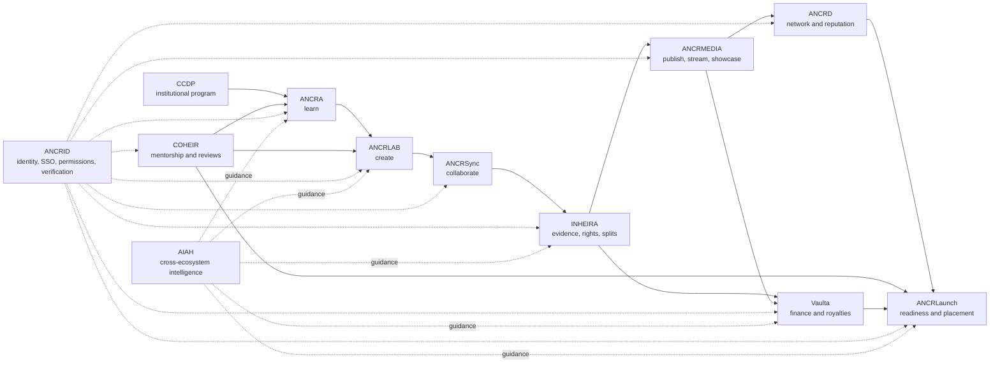
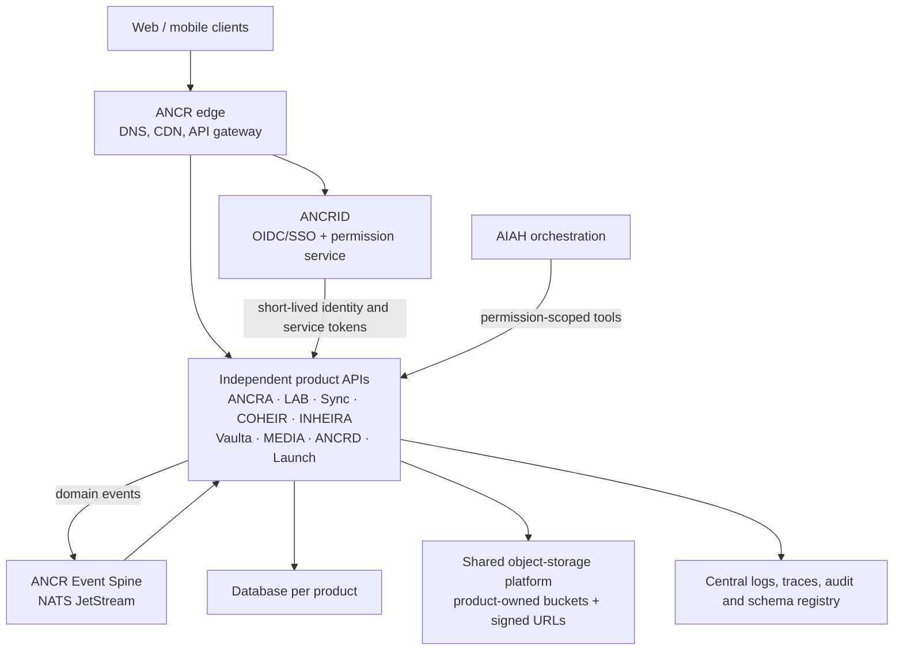

# ANCR Ecosystem: How the Products Work Together

**Status:** Code-backed architecture overview  
**Reviewed:** 2026-09-02  
**Scope:** Product specifications in `_Docs/_CCDP/UPdated` plus the applications in this repository

## Executive overview

ANCR is best understood as a **creator-lifecycle platform**, not a collection of unrelated applications. CCDP is the institutional program and public entry point. ANCR is the digital ecosystem underneath it. Each core product owns one stage of a creator's journey and contributes verified records to a lifelong ANCRID identity.

The intended lifecycle is:

> **Learn → Create → Collaborate → Verify ownership → Publish → Earn → Build reputation → Launch a career**

ANCRID supplies identity, authentication, permissions, and verification across the whole lifecycle. AIAH supplies intelligence and guidance. The other modules own domain records and exchange canonical IDs, references, and events; they should not copy one another's authoritative data.

The repository currently contains strong, mostly independent product prototypes. The target ecosystem is clear, but the runtime integration is not complete: most applications still maintain local users and local JWTs, no shared event bus is running, and most cross-product data is seeded or represented inside one application's database rather than exchanged between deployed services.

## The ecosystem at a glance

The solid arrows show the creator's main lifecycle. The dotted lines show cross-cutting services used throughout the ecosystem.

## Core product ownership

One system should be authoritative for each canonical record. Other products consume a reference or projection of that record.

| Product | Question it answers | Canonical responsibility | Primary downstream consumers |
|---|---|---|---|
| **ANCRID** | Who is this creator, and what may they access? | Identity, account, roles, institution, permissions, verification, Creator Passport, mobility and booking packet | Every product |
| **ANCRA** | What are they learning and achieving? | Courses, assignments, academic progress, certificates, learning outcomes | ANCRID, COHEIR, ANCRD, ANCRLaunch |
| **ANCRLAB** | Where and how was the work created? | Creative projects, studio sessions, room bookings, stems, masters and source assets | ANCRSync, INHEIRA, ANCRMEDIA |
| **ANCRSync** | Who are they creating with? | Creative workspaces, teams, shared sessions, writing rooms, messages and collaboration history | ANCRID, INHEIRA, COHEIR, ANCRLaunch |
| **COHEIR** | Who is guiding and validating their growth? | Mentorship sessions, reviews, recommendations, cohorts and professional relationships | ANCRID, ANCRD, ANCRLaunch |
| **INHEIRA** | Who contributed what, and who legally owns what? | Creative evidence, versions, contributions, splits, rights, credits and publishing readiness | ANCRID, ANCRMEDIA, Vaulta, ANCRD, ANCRLaunch |
| **Vaulta** | What happened financially? | Income, expenses, contracts, invoices, grants, taxes, royalty accounting and financial analytics | ANCRID and ANCRLaunch; summaries back to media and business views |
| **ANCRMEDIA** | Where can the world experience the work? | Media presentation, channels, playback, streaming, discovery, playlists, livestreams and engagement analytics | ANCRID, ANCRD, Vaulta, ANCRLaunch |
| **ANCRD** | How does verified work become professional reputation? | Professional graph, feed, communities, reputation display, marketplace, events and networking | ANCRLaunch and employer-facing experiences |
| **ANCRLaunch** | What is the creator ready for next? | Career-readiness calculations, opportunities, applications, interviews, employer workflows, placements and graduate outcomes | Creator, institutions and employers |

### Supporting and extended products

These applications are valuable, but they sit outside the ten-module model used by the supplied canonical product specifications.

| Product | Place in the ecosystem | Boundary to preserve |
|---|---|---|
| **CCDP / ANCR Web** | Public institutional website, partnership funnel, CRM and program/storefront entry point | It should introduce and route into ANCR, not become the owner of creator records |
| **CYNAIAH** | Film, visual storytelling and emerging-media school/workspace | It should create projects and evidence through ANCRA/ANCRLAB contracts, then hand rights to INHEIRA and media to ANCRMEDIA |
| **ANCR Passport** | Study abroad, cultural learning, travel readiness and global classroom | Keep separate from **Creator Passport**, which is the verified professional record owned by ANCRID |
| **VIERATA** | Creator wellness, health and human-performance support | Sensitive wellness data needs its own permission boundary; only readiness-safe summaries should leave the module |
| **ANCRSHOP** | Ecosystem commerce, catalog, checkout, orders, loyalty and merchandising | One commerce owner is needed because CCDP Web also contains store/customer/order workflows |

ANCRWAV and ANCRVIEW are audio and video experiences inside ANCRMEDIA, rather than separate systems of record.

## One end-to-end creator story

This is the simplest way to explain how the platform works to institutions, creators, engineers and investors.

1. **Identity begins in ANCRID.** A creator receives one permanent ANCRID, institution affiliation, roles and permission grants.
2. **Learning begins in ANCRA.** A course assignment or capstone creates the academic context and expected outcomes.
3. **Creation happens in ANCRLAB.** The creator books a studio, starts a project, records source assets and produces versioned stems or masters. CYNAIAH can provide the film/visual-production experience for a visual project.
4. **Collaboration happens in ANCRSync.** Collaborators join a verified workspace, exchange assets, record sessions and create a durable collaboration history.
5. **Guidance comes from COHEIR.** Faculty and industry mentors review the work. Recommendations and verified professional interactions become evidence attached to the creator's identity.
6. **Provenance and rights are finalized in INHEIRA.** Versions, contributions and Creative Evidence are documented. Human-approved splits remain legally distinct from AI observations or contribution analysis.
7. **The work is published through ANCRMEDIA.** ANCRWAV or ANCRVIEW presents the release, while identity and rights metadata remain referenced from ANCRID and INHEIRA.
8. **Money is recorded in Vaulta.** Streaming, licensing and other income becomes royalty and financial records connected to the release and contributors.
9. **Professional reputation grows in ANCRD.** Verified releases, credits, collaborations, mentor recommendations and milestones become discoverable professional proof.
10. **ANCRLaunch assembles the career view.** It calculates readiness from verified ecosystem records and connects the creator with opportunities, applications, interviews and placements.

Throughout the journey, **AIAH advises but does not become the source of truth**. It may explain, recommend, summarize or match; authoritative outcomes remain in the domain-owning product and, where required, require human approval.

## Target technical architecture

### Integration rules

1. **ANCRID is the only production identity provider.** Product databases store `ancrid`, product-specific state and permitted public projections; they do not store passwords.
2. **Each product owns its database.** No service reads another service's collections directly.
3. **Canonical IDs cross boundaries unchanged.** At minimum: `ancrid`, `institution_id`, `project_id`, `session_id`, `asset_id`, `work_id`, `release_id`, `opportunity_id` and `event_id`.
4. **State changes publish versioned events.** Events carry `schema_version`, `event_id`, `occurred_at`, `actor_ancrid`, `subject_ref`, `correlation_id` and `idempotency_key`.
5. **Files cross products by reference.** A URI, hash, media type and access policy travel with the event; the file is not silently copied into every product.
6. **Synchronous calls are reserved for current reads.** APIs are appropriate for permission checks, current public projections and user-initiated commands. Durable state propagation belongs on the event spine.
7. **Consumers are idempotent.** At-least-once delivery must not create duplicate credits, payouts, applications or timeline entries.
8. **AIAH receives least-privilege access.** It uses product APIs and permission-scoped tools; it never bypasses domain validation or silently writes legal/financial outcomes.

### Recommended first event catalog

| Event | Publisher | Main consumers |
|---|---|---|
| `identity.created.v1`, `identity.updated.v1`, `identity.permission_changed.v1` | ANCRID | All products |
| `learning.assignment_created.v1`, `learning.credential_awarded.v1` | ANCRA | ANCRLAB, ANCRID, ANCRLaunch |
| `creative.project_created.v1`, `creative.asset_exported.v1`, `creative.master_ready.v1` | ANCRLAB | ANCRSync, INHEIRA, ANCRMEDIA |
| `collaboration.session_closed.v1`, `collaboration.credit_proposed.v1` | ANCRSync | ANCRID, INHEIRA, COHEIR |
| `mentorship.review_completed.v1`, `mentorship.recommendation_issued.v1` | COHEIR | ANCRID, ANCRD, ANCRLaunch |
| `rights.splits_approved.v1`, `rights.work_registered.v1`, `release.ready.v1` | INHEIRA | ANCRMEDIA, Vaulta, ANCRD |
| `media.release_published.v1`, `media.stream_aggregated.v1` | ANCRMEDIA | ANCRID, Vaulta, ANCRD, ANCRLaunch |
| `finance.royalty_accrued.v1`, `finance.payment_recorded.v1` | Vaulta | Creator dashboards and permitted analytics consumers |
| `network.reputation_changed.v1` | ANCRD | ANCRID, ANCRLaunch |
| `career.application_changed.v1`, `career.placement_verified.v1` | ANCRLaunch | ANCRID, ANCRA/institution outcomes, ANCRD |

## What the repository implements today

The applications share a common prototype stack—React SPA, FastAPI and MongoDB—but are not yet operating as a federated production platform.

| Product / folder | Implemented evidence in code | Identity today | Ecosystem integration today |
|---|---|---|---|
| `CCDP-ANCR-WEB` | Institutional site, inquiries CRM, admin, store and orders | Separate admin/customer auth | Public gateway; no shared creator identity |
| `ANCR-ANCRID` | Identity/profile, Creator Passport, files, SSO token issue/verify, mobility and booking packets | Its own cookie/JWT auth; intended ecosystem issuer | SSO provider exists, but consumers are not wired to it |
| `ANCR-ANCRA1.1` | Student/faculty learning dashboards, journeys, assignments, capstones, portfolio and AIAH | Active seeded persona; no real user authentication | Seeded ecosystem hub data; no service calls/events |
| `ANCR-ANCRD1.2` | Feed, profiles, follows, communities, events, marketplace, messaging, institution/employer views | Local users and JWT | Independent prototype |
| `ANCR-ANCRMEDIA` | ANCRWAV/ANCRVIEW catalog, discovery, creators, institutions, playlists, library and analytics | Local users, cookies/JWT | Independent media catalog; no INHEIRA/Vaulta event exchange |
| `ANCR-COHEIR` | Mentors, students, cohorts, sessions, reviews, recommendations, share kits and analytics | Local users/session auth | ANCRID fields are modeled, but federation is not live |
| `ANCR-INHEIRA` | Sessions, lyrics, events, versions, Creative Evidence, voice evidence, contributions, splits, rights, reports and integrations | Local users and JWT | Strong domain implementation; external module connections remain planned/placeholders |
| `ANCR-VAULTA` | Transactions, royalties, publishing views, contracts, invoices, budgets, taxes, grants, projects and reports | Local users and JWT | Ecosystem data is locally represented; no live finance event ingestion |
| `ANCR-ANCRSYNC-` | This is actually the **ANCRLaunch** API/UI: readiness, portfolio assembly, resume, opportunities, applications, interviews and outcomes | Locally minted token labeled with ANCRID issuer | Reads prefixed collections from the same Mongo database to simulate module providers |
| ANCRSync collaboration | Product specification and design references | Not implemented as a standalone service | No collaboration service/event publisher found |
| ANCRLAB | Design-complete module page and technical specification | Target is ANCRID claims | No standalone backend; bookings, assets, DAW and export pipeline are still target architecture |
| `ANCR-CYNAIAH` | Large film/visual creation suite, production, review, rights, finishing, AI and append-only review evidence | Local JWT, prepared for later ANCRID swap | Outbound ANCR notification envelope exists; bus sink is disabled/not configured |
| `ANCR-PASSPORT` | Travel, cultural learning, translator, trips, safety, global classroom and music compass | Hard-coded demo user (`UID = "maya"`); no authentication | Standalone demo |
| `ANCR-VIERATA` | Wellness, creative-performance check-ins, programs and VIEA assistant | Local JWT and generated ANCRID-shaped value | ANCR handshake/status is modeled but not activated |
| `ANCR-ANCRSHOP` | Catalog, cart, wishlist, checkout, Stripe, orders, loyalty/admin and AIAH | Separate commerce users/JWT | Standalone commerce application |

Key code references:

- ANCRID's SSO clients and five-minute token flow: [`ANCR-ANCRID/backend/server.py`](../ANCR-ANCRID/backend/server.py#L763)
- ANCRA's current seeded-persona model: [`ANCR-ANCRA1.1/backend/server.py`](../ANCR-ANCRA1.1/backend/server.py#L97)
- ANCRLaunch identity and same-database ecosystem assembler: [`ANCR-ANCRSYNC-/backend/server.py`](../ANCR-ANCRSYNC-/backend/server.py#L1) and [`ecosystem.py`](../ANCR-ANCRSYNC-/backend/ecosystem.py#L1)
- ANCRLAB's target-only service architecture: [`ANCRLAB-Technical-Specification.md`](../ANCR-ANCRA1.1/docs/ANCRLAB-Technical-Specification.md#L21)
- CYNAIAH's future-ANCRID structure and event adapter: [`ANCR-CYNAIAH/backend/server.py`](../ANCR-CYNAIAH/backend/server.py#L1) and [`ancr_notifications.py`](../ANCR-CYNAIAH/backend/ancr_notifications.py#L1)
- INHEIRA's current local system and creative-evidence APIs: [`ANCR-INHEIRA/backend/server.py`](../ANCR-INHEIRA/backend/server.py#L1)
- The earlier ecosystem/event-bus target: [`ANCR_Ecosystem_Architecture_Specification_v1.0.md`](../ANCR-ANCRMEDIA/docs/ANCR_Ecosystem_Architecture_Specification_v1.0.md#L1)

## Conflicts that need an explicit product decision

The supplied documents and repository contain multiple generations of architecture. These should not all be treated as equally canonical.

### 1. ANCRSync versus ANCRLaunch

The supplied ANCRSync product specification defines **creative collaboration**. The `ANCR-ANCRSYNC-` code folder identifies itself as ANCRLaunch and implements career placement. Rename the folder/repository to `ANCR-ANCRLAUNCH` and create a distinct home for the collaboration product before deployment automation is introduced.

### 2. ANCRA's role

The current ANCRA product specification and code define ANCRA as the **learning operating system**. One INHEIRA architecture document redefines ANCRA as the analytics/event bus. Keep ANCRA as learning and name the infrastructure neutrally—**ANCR Event Spine**—so a product is not confused with transport infrastructure.

### 3. ANCRSync's domain

One INHEIRA architecture document uses ANCRSync for sync-licensing catalog/placement, while the current product specification uses it for collaborative workspaces. The product spec and broad code language favor collaboration. Treat sync licensing as an INHEIRA/CYNAIAH-to-industry capability or give it a separately named future service.

### 4. COHEIR's domain

The current COHEIR product specification and code implement mentorship, reviews and professional relationships. An older INHEIRA architecture assigns estate/heir responsibilities to COHEIR. Keep COHEIR focused on mentorship; place rights succession with INHEIRA and financial/estate execution with Vaulta, subject to legal design.

### 5. Two meanings of “Passport”

- **Creator Passport** is the lifelong verified professional record owned by ANCRID.
- **ANCR Passport** is a global travel, culture and study-abroad product.

Both can exist, but UI and API names should always use the full terms.

### 6. Two commerce implementations

CCDP Web contains customer auth, catalog, checkout and order handling, while ANCRSHOP implements a broader commerce system. Select one commerce system of record and let the other call it. Duplicated customers, inventory and orders will otherwise diverge.

### 7. Ten core modules versus extensions

The supplied product set uses ten numbered modules, while the code also includes CYNAIAH, Passport, VIERATA and ANCRSHOP. Document these as **vertical experiences and platform extensions**, not additional core systems of record, unless governance formally revises the canonical module model.

## Recommended integration sequence

### Phase 0 — Establish one canonical map

- Approve the ownership table in this document.
- Rename `ANCR-ANCRSYNC-` to ANCRLaunch.
- Publish a module registry containing product name, slug, owner, public URL, API audience, canonical entities and status.
- Mark older contradictory architecture documents as superseded rather than silently leaving several “canonical” versions.

### Phase 1 — Make ANCRID real across products

- Move ANCRID from demo SSO verification to a standard OIDC/JWKS contract.
- Add all active products to its client registry, including COHEIR, ANCRMEDIA, ANCRD, CYNAIAH, VIERATA and ANCRSHOP if appropriate.
- Replace product-local login/password storage with ANCRID token verification.
- Backfill one stable `ancrid` onto all existing local records.
- Centralize consent, role and field-level permission policies.

### Phase 2 — Define contracts before moving data

- Publish JSON Schemas for canonical IDs and the first event catalog.
- Add an outbox table/collection to each product so writes and event publication remain consistent.
- Stand up NATS JetStream with dead-letter handling and idempotency tracking.
- Start with three high-value flows: `identity.updated`, `creative.master_ready`, and `rights.splits_approved`.

### Phase 3 — Complete the creator lifecycle

- Build the standalone ANCRLAB asset/export service.
- Build the actual ANCRSync collaboration service.
- Replace ANCRLaunch's same-database provider collections with product APIs/event projections.
- Connect INHEIRA → ANCRMEDIA → Vaulta for release, stream and royalty flows.
- Connect COHEIR/ANCRD evidence into ANCRLaunch readiness without copying authoritative records.

### Phase 4 — Unify the product experience

- Ship a shared `@ancr/ui` design system and ecosystem launcher.
- Preserve product-specific identity while giving every product the same account, notification, consent and app-switching behavior.
- Give AIAH a shared tool gateway with permission-scoped product actions and complete audit trails.
- Add ecosystem-wide observability using correlation IDs from user action through events and downstream projections.

## Definition of “interconnected” for production

The ecosystem should only be called fully interconnected when all of the following are true:

- One login opens every authorized product.
- One `ancrid` follows the creator through every product.
- Each canonical record has one declared owner.
- Cross-product updates arrive through versioned APIs/events rather than shared database reads.
- Files are referenced by immutable IDs/hashes and protected URLs.
- Revoking identity or consent propagates across all products.
- A complete audit trail explains which person/service changed each record.
- AIAH actions respect product permissions and human-approval boundaries.
- The full lifecycle—from learning assignment to verified placement—can be traced with a single correlation chain.

## Source set reviewed

External product specifications under `C:\Users\Schar\@CODE\_Jira\ANCR Build\_Docs\_CCDP\UPdated`:

- `ANCRA_Product_Specification_v1.0 (1) (1).pdf`
- `ANCRD_Product_Specification_v1.0 (1).pdf`
- `ANCRID_Product_Specification_v1.0 (1).pdf`
- `ANCRLaunch_Product_Specification_v1_0 (1).pdf`
- `ANCRMEDIA_Product_Specification_v1.0 (3).pdf`
- `ANCRSync_Product_Specification_v1_0 (1) (1).pdf`
- `COHEIR_Product_Specification_v1.0 (2).pdf`
- `Vaulta_Product_Specification_v1_0 (3).pdf`

The folder does not contain ANCRLAB or INHEIRA product PDFs. Their repository technical specifications and implementation were used to complete those portions of the model.
